``` r
library(tidyverse)
library(grid)
library(ggplot2)
library(knitr)
library(kableExtra)
library(tidymodels)
library(usemodels)
```


# Cohort results

We load the data from our analysis


``` r
kmer_analysis <- read_csv("kmer_analysis.csv")
```

Let's see the distribution of the number of reads for the tumor, normal, and their difference

First, for tumor:


``` r
kmer_analysis |>
  filter(l==9) |>
  ggplot(aes(tumor_num_reads)) +
  geom_histogram(bins=20)
```

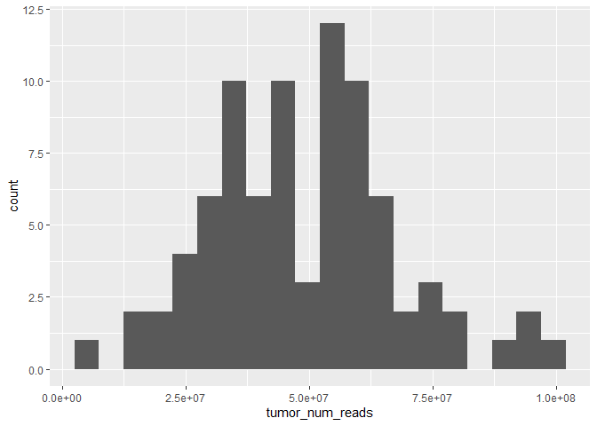<!-- -->

``` r
kmer_analysis |>
  filter( tumor_num_reads<2*10^7) |>
  filter(l==9) |>
  select(sample_name, tumor_num_reads, normal_num_reads) |>
  kable(format = 'pipe', boarder=5, digits=2,
          format.args = list(big.mark = ",",scientific = FALSE))
```


|sample_name  | tumor_num_reads| normal_num_reads|
|:------------|---------------:|----------------:|
|MSS_20       |      18,337,860|       41,931,699|
|MSI_MLH1G_14 |      13,251,907|       23,954,097|
|MSI_MLH1G_6  |      13,983,794|       39,437,183|
|MSI_MSH2_5   |       3,432,959|       93,100,071|

And for normal


``` r
kmer_analysis |>
  filter(l==9) |>
  ggplot(aes(normal_num_reads)) +
  geom_histogram(bins=20)
```

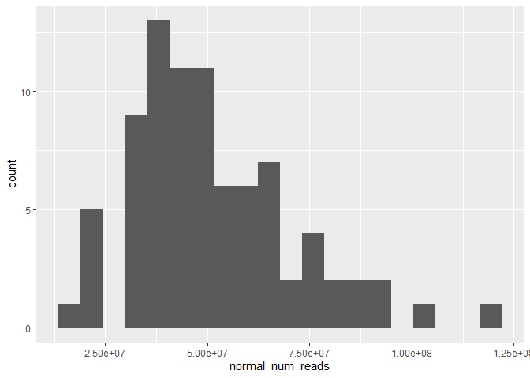<!-- -->

``` r
kmer_analysis |>
  filter( normal_num_reads<2*10^7) |>
  filter(l==9) |>
  select(sample_name, tumor_num_reads, normal_num_reads) |>
  kable(format = 'pipe', boarder=5, digits=2,
          format.args = list(big.mark = ",",scientific = FALSE))
```


|sample_name | tumor_num_reads| normal_num_reads|
|:-----------|---------------:|----------------:|
|MSI_MSH2_9  |      55,279,613|       15,194,412|


And for the difference:


``` r
kmer_analysis |>
  filter(l==9) |>
  ggplot(aes(tumor_num_reads-normal_num_reads)) +
  geom_histogram(bins=25)
```

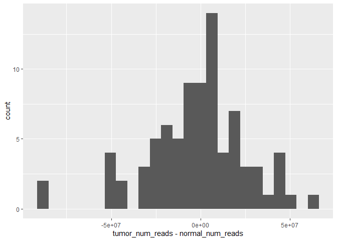<!-- -->

We implementing the following filteria criteria for our samples:

* More than 20 million reads in both normal and tumor
* Difference in coverage between normal and tumor does not exceed 50 million reads
* Were excluded in the analysis in https://pubmed.ncbi.nlm.nih.gov/33549857/, due to ambigous status (MSS6 and PMS2_9 had also POLE mutations)


``` r
kmer_tbl_filter <- kmer_analysis |>
  filter( (abs(tumor_num_reads-normal_num_reads)< 5*10^7) ) |>
  filter( tumor_num_reads > 2*10^7) |>
  filter( normal_num_reads >2*10^7) |>
  filter(sample_name != "MSS_6"  & sample_name!="PMS2_9") |>
  mutate(status = if_else(identifier=="MSI_MLH1G" | identifier =="MSI_MLH1HM" 
                          | identifier =="MSI_MSH2" | identifier =="MSI_MSH6" 
                          | identifier =="MSI_PMS2", "MSI-H", "MSS"),
         status = factor(status, levels=c("MSS", "MSI-H")),
         status_num = if_else(status=="MSI", 1, 0))
```

Let's collect the number of reads statistics for each sample


``` r
kmer_tbl_filter |>
  filter(l==9) |>
  select(tumor_num_reads,normal_num_reads) |>
  pivot_longer(c(tumor_num_reads, normal_num_reads), names_to="Read number") |>
  group_by(`Read number`)|>
  summarize(med = median(value),
            iqr = IQR (value)) |>
  kable(format = 'pipe',digits = 3, 
        format.args = list(big.mark = ",",scientific = FALSE))
```


|Read number      |        med|        iqr|
|:----------------|----------:|----------:|
|normal_num_reads | 46,781,392| 21,800,764|
|tumor_num_reads  | 53,657,070| 20,196,668|


Let's tally how many samples we have by type:


``` r
kmer_tbl_filter |>
  filter(l==9) |>
  count(status) |>
  kable()
```


|status |  n|
|:------|--:|
|MSS    | 14|
|MSI-H  | 56|


# K-mer and time statistics


## Numbers of kmers with increasing mononucleotide repeat length

We are interested in quantifying the number of kmers for the first phase of our algorithm:


``` r
kmer_tbl_filter |>
  ggplot(aes(x=as.factor(l), y=num_kmers)) +
  geom_boxplot() + 
  scale_y_log10() +
  labs(y="Number of k-mers", x="Length of mononucleotide")
```

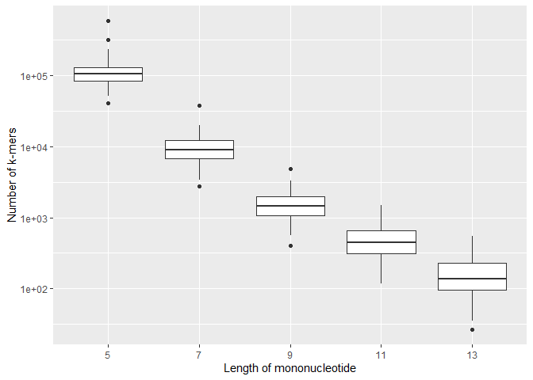<!-- -->


``` r
kmer_tbl_filter |>
  group_by(l) |>
  summarize(med = median (num_kmers),
            iqr = IQR(num_kmers))|>
  kable(format = 'pipe', digits = 3, 
        format.args = list(big.mark = ",",scientific = FALSE))
```


|  l|       med|       iqr|
|--:|---------:|---------:|
|  5| 104,840.5| 45,955.75|
|  7|   9,037.0|  5,336.00|
|  9|   1,447.0|    895.75|
| 11|     445.0|    338.75|
| 13|     138.0|    129.75|

Increasing the size of the mono nucleotides repeat considered has an exponential effect on the number of k-mers used. Let's notice that by using mononucleotides of size 9 our median number of kmers is 1,408 with an IQR of 912.5.


## Running time as a function of mononucleotide repeat

Our algorithm has two phases:

1. In the first phase it filters the number of k-mers

2. In the second phase it calculates the indel using a standard bioinformatic approach

We will be quantifying the times it takes for these two phases across our cohort


``` r
kmer_tbl_filter |>
  select(sample_name, l, KMER_TIME, PROC_TIME) |>
  group_by(l) |>
  summarize("Phase I median" = median (KMER_TIME),
            "Phase I iqr " = IQR (KMER_TIME),
            "Phase II median " = median(PROC_TIME),
            "Phase I iqr" = IQR (PROC_TIME),
            "Total median" = median(KMER_TIME+PROC_TIME),
            "Total iqr"= IQR(KMER_TIME+PROC_TIME)) |>
    kable(format = 'pipe', boarder=5, digits=0)
```


|  l| Phase I median| Phase I iqr | Phase II median | Phase I iqr| Total median| Total iqr|
|--:|--------------:|------------:|----------------:|-----------:|------------:|---------:|
|  5|            209|           55|              292|         148|          504|       167|
|  7|             68|           15|               62|          16|          132|        26|
|  9|             67|           16|               37|           8|          108|        20|
| 11|             68|           16|               36|           8|          106|        19|
| 13|             66|           15|               31|           7|          100|        20|


Let's notice that for mononucleotide lenght of 7 and up, our median filtering phase is around 68 (16)s and it is pretty stable after that. Our second phase plateaus around 35 seconds. Seems the time decrease is marginal so we stop around k=9.

## Reads, kmers, and insertions/deletions


As we increase the number of reads, we expect to have more k-mers in our synthetic reference. Let's do a quick plot to verify that:


``` r
kmer_tbl_filter |>
  ggplot(aes(tumor_num_reads, num_kmers)) +
  geom_point()+
  scale_y_log10()+
  facet_grid(~l)+
  geom_smooth(method="lm")
```

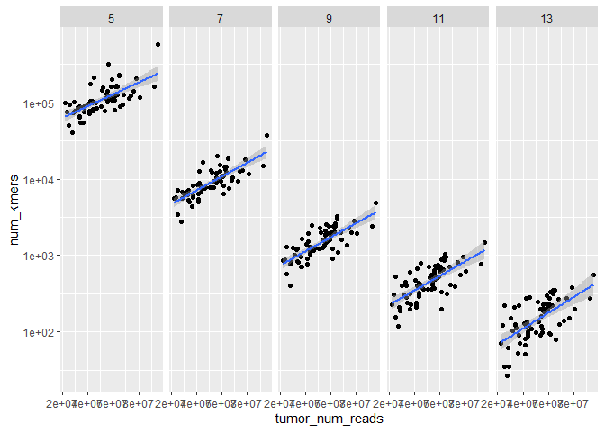<!-- -->

We also expect that as our number of k-mers increases, the indels that we find will increase as well


``` r
kmer_tbl_filter |>
  ggplot(aes(num_kmers, num_indels)) +
  geom_point()+
  scale_y_log10()+
  scale_x_log10()+
  facet_grid(~l)+
  geom_smooth(method="lm")
```

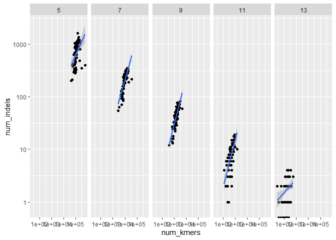<!-- -->

Let's go into detail for `l=9` breaking it down by deletions, insertions:


``` r
kmer_tbl_filter |>
  filter(l==9) |>
  select(num_kmers, num_indels, num_deletions, num_insertions) |>
  pivot_longer(c(num_indels, num_deletions, num_insertions))|>
  ggplot(aes(num_kmers, value)) +
  geom_point()+
  geom_smooth(method="lm")+
  facet_grid(.~name)
```

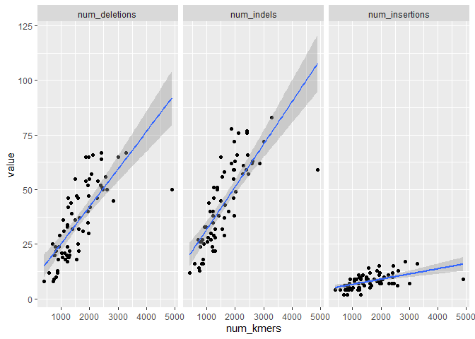<!-- -->

Seems the number of deletions is much higher than the number of deletions.

This motivates us to normalize indels, deletions, and insertions using the number of k-mers as a denominator:


``` r
kmer_tbl_filter <- kmer_tbl_filter |>
  mutate(indel_dens = num_indels/num_kmers*1000,
         ins_dens = num_insertions/num_kmers*1000,
         del_dens = num_deletions/num_kmers*1000 )
```

And we finally consider only when l=9 for the remaining of the analysis


``` r
kmer_tbl_analysis <- kmer_tbl_filter |>
  filter(l==9)
```

# MSI status and number of indels


We expect to see differences in number of indels across MSI status


``` r
kmer_tbl_analysis |>
  ggplot(aes(x=status, y=indel_dens, fill=status)) +
  geom_boxplot()
```

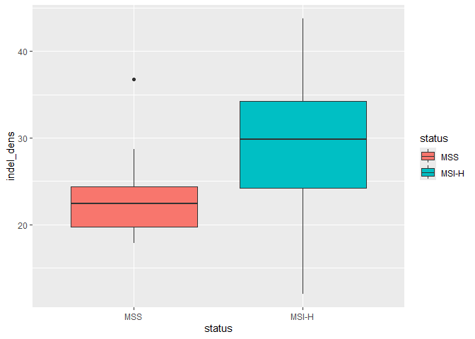<!-- -->

And according to https://pmc.ncbi.nlm.nih.gov/articles/PMC7111525/ we should see more separation in deletions


``` r
kmer_tbl_analysis |>
  ggplot(aes(x=status, y=del_dens, fill=status)) +
  geom_boxplot()
```

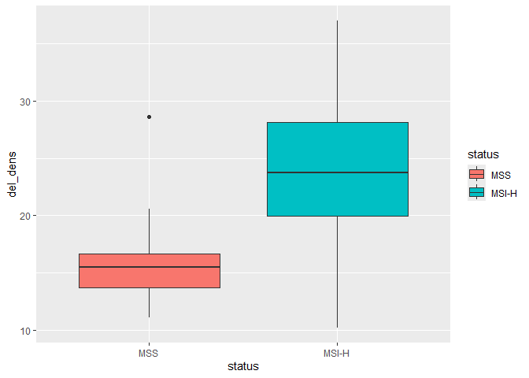<!-- -->

Let's combine those two plots in a single image


``` r
kmer_tbl_analysis |>
  select(status, indel_dens, del_dens) |>
  pivot_longer(c(indel_dens, del_dens)) |>
  ggplot(aes(status, value, fill=status)) +
  geom_boxplot()+
  facet_grid(.~name)
```

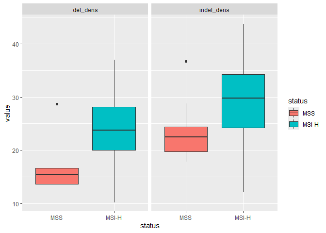<!-- -->


``` r
kmer_tbl_analysis |>
  group_by(status) |>
  summarize(mean_indel=mean(indel_dens),
            sd_indel=sd(indel_dens),
            mean_del=mean(del_dens), 
            sd_del=sd(del_dens))|>
  kable(format = 'pipe', boarder=5, digits = 1, 
        format.args = list(big.mark = ",",scientific = FALSE))
```


|status | mean_indel| sd_indel| mean_del| sd_del|
|:------|----------:|--------:|--------:|------:|
|MSS    |       23.2|      4.9|     16.1|    4.5|
|MSI-H  |       29.3|      6.9|     24.2|    6.5|

And here are the results for the t-test for:

* Indel density:


``` r
mosaic::t.test(indel_dens~status, data=kmer_tbl_analysis)
```

```
## 
## 	Welch Two Sample t-test
## 
## data:  indel_dens by status
## t = -3.7907, df = 27.214, p-value = 0.0007605
## alternative hypothesis: true difference in means between group MSS and group MSI-H is not equal to 0
## 95 percent confidence interval:
##  -9.373009 -2.791156
## sample estimates:
##   mean in group MSS mean in group MSI-H 
##            23.18362            29.26570
```

* Deletion density


``` r
mosaic::t.test(del_dens~status, data=kmer_tbl_analysis)
```

```
## 
## 	Welch Two Sample t-test
## 
## data:  del_dens by status
## t = -5.4576, df = 27.855, p-value = 8.084e-06
## alternative hypothesis: true difference in means between group MSS and group MSI-H is not equal to 0
## 95 percent confidence interval:
##  -11.14963  -5.06304
## sample estimates:
##   mean in group MSS mean in group MSI-H 
##            16.10369            24.21002
```


# Predicting MSI status

We first start by dividing into testing/training. Since our dataset is small we divide equally and we stratify by status, since we have few MSS cases


``` r
set.seed(2568)

kmer_split <- initial_split(kmer_tbl_analysis, prop=0.5, strata=status)
kmer_training = training(kmer_split)
kmer_testing = testing(kmer_split)
```

We will be creating some boilerplate for creating and evaluating logistic models


``` r
fit_logistic <- function(recipe, train) {
  logit_model <- 
    logistic_reg() |> 
    set_mode("classification") |> 
    set_engine("glm")
  
  logit_wf <- workflow()|>
    add_model(logit_model) |>
    add_recipe(recipe)

  fit(logit_wf, data = train)  
}

evaluate_model <- function (model, test) {
  class_metrics <- metric_set(accuracy, specificity, sensitivity)
  
  roc_auc <- augment(model, test) |>
    roc_auc(status, .pred_MSS)

  augment(model, test) |>
    class_metrics(status, estimate=.pred_class) |>
    bind_rows(roc_auc)
}

plot_ROC <- function (model, test) {
  augment(model, test) |>
    roc_curve(status, .pred_MSS) |>
    autoplot()
}
```

And we will test with a simple model based on the number of indel density


``` r
logit_indels_rec <- recipe (formula = status ~ indel_dens, data=kmer_training)

logit_indel1 <- fit_logistic(logit_indels_rec, kmer_training)

augment(logit_indel1, kmer_testing) |>
    conf_mat(status, .pred_class)
```

```
##           Truth
## Prediction MSS MSI-H
##      MSS     1     3
##      MSI-H   6    25
```

``` r
evaluate_model(logit_indel1, kmer_testing) |>
    kable(format = 'pipe', boarder=5, digits=2)
```


|.metric     |.estimator | .estimate|
|:-----------|:----------|---------:|
|accuracy    |binary     |      0.74|
|specificity |binary     |      0.89|
|sensitivity |binary     |      0.14|
|roc_auc     |binary     |      0.72|

``` r
plot_ROC(logit_indel1, kmer_testing)
```

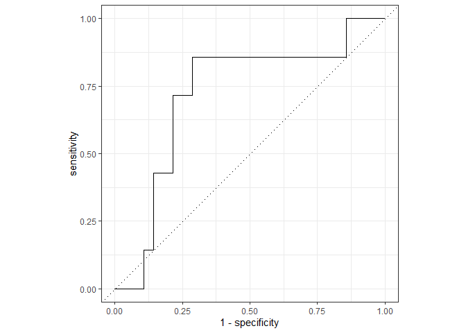<!-- -->

Not great, ah?. Let's refine our approach by adding the densitiy of deletions as well


``` r
logit_2_rec <- recipe (formula = status ~ del_dens + indel_dens, data=kmer_training)
logit_indel2 <- fit_logistic(logit_2_rec, kmer_training)

augment(logit_indel2, kmer_testing) |>
    conf_mat(status, .pred_class)
```

```
##           Truth
## Prediction MSS MSI-H
##      MSS     6     4
##      MSI-H   1    24
```

``` r
evaluate_model(logit_indel2, kmer_testing) |>
    kable(format = 'pipe', boarder=5, digits=2)
```


|.metric     |.estimator | .estimate|
|:-----------|:----------|---------:|
|accuracy    |binary     |      0.86|
|specificity |binary     |      0.86|
|sensitivity |binary     |      0.86|
|roc_auc     |binary     |      0.93|

``` r
plot_ROC(logit_indel2, kmer_testing)
```

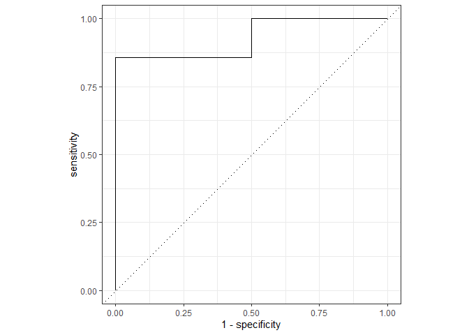<!-- -->

And let's see the samples that are mis-sclassified


``` r
augment(logit_indel2, kmer_testing) |>
  filter(.pred_class != status) |>
  select(sample_name, num_kmers, num_insertions, num_deletions) |>
    kable(format = 'pipe', boarder=5, digits=2,
          format.args = list(big.mark = ",",scientific = FALSE))
```


|sample_name  | num_kmers| num_insertions| num_deletions|
|:------------|---------:|--------------:|-------------:|
|MSS_7        |     1,361|             11|            39|
|MSI_MLH1HM_9 |     4,894|              9|            50|
|MSI_MSH2_7   |       862|              4|            12|
|MSI_MSH6_4   |       404|              4|             8|
|MSI_PMS2_4   |     1,053|              9|            19|


And let's look at the model


``` r
tidy(logit_indel2) |>
    kable(format = 'pipe', boarder=5, digits=2)
```


|term        | estimate| std.error| statistic| p.value|
|:-----------|--------:|---------:|---------:|-------:|
|(Intercept) |    -3.38|      3.05|     -1.11|    0.27|
|del_dens    |     0.83|      0.39|      2.10|    0.04|
|indel_dens  |    -0.45|      0.33|     -1.36|    0.17|

Finally let's quickly visualize the decision boundary for our model


``` r
summary(kmer_testing$indel_dens)
```

```
##    Min. 1st Qu.  Median    Mean 3rd Qu.    Max. 
##   12.06   22.95   29.70   28.60   35.21   41.73
```

``` r
summary(kmer_testing$del_dens)/1000
```

```
##    Min. 1st Qu.  Median    Mean 3rd Qu.    Max. 
## 0.01022 0.01682 0.02047 0.02284 0.02865 0.03695
```

``` r
del_vec = seq(0.01,0.04, by=0.0001)*1000
indel_vec = seq(0.01,0.05, by=0.0001)*1000
grid_tbl <- expand_grid(del_dens=del_vec, indel_dens=indel_vec)

ggplot(kmer_testing) +
  geom_point(aes(del_dens, indel_dens, shape=status, color=status),size=3)+
  geom_tile(data=augment(logit_indel2, grid_tbl),
            aes(del_dens, indel_dens, fill=.pred_MSS),
            alpha=0.3)+
  scale_fill_viridis_b() 
```

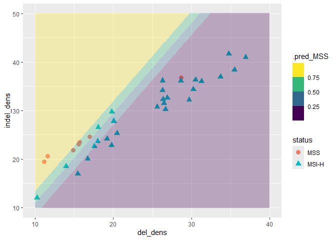<!-- -->

This analysis was done using the following environment


``` r
sessionInfo()
```

```
## R version 4.4.2 (2024-10-31 ucrt)
## Platform: x86_64-w64-mingw32/x64
## Running under: Windows 11 x64 (build 26100)
## 
## Matrix products: default
## 
## 
## locale:
## [1] LC_COLLATE=English_United States.utf8 
## [2] LC_CTYPE=English_United States.utf8   
## [3] LC_MONETARY=English_United States.utf8
## [4] LC_NUMERIC=C                          
## [5] LC_TIME=English_United States.utf8    
## 
## time zone: America/Chicago
## tzcode source: internal
## 
## attached base packages:
## [1] grid      stats     graphics  grDevices utils     datasets  methods  
## [8] base     
## 
## other attached packages:
##  [1] mosaicData_0.20.4  ggformula_0.12.0   Matrix_1.7-1       lattice_0.22-6    
##  [5] usemodels_0.2.0    yardstick_1.3.2    workflowsets_1.1.0 workflows_1.1.4   
##  [9] tune_1.2.1         rsample_1.2.1      recipes_1.1.0      parsnip_1.2.1     
## [13] modeldata_1.4.0    infer_1.0.7        dials_1.3.0        scales_1.3.0      
## [17] broom_1.0.7        tidymodels_1.2.0   kableExtra_1.4.0   knitr_1.49        
## [21] lubridate_1.9.4    forcats_1.0.0      stringr_1.5.1      dplyr_1.1.4       
## [25] purrr_1.0.2        readr_2.1.5        tidyr_1.3.1        tibble_3.2.1      
## [29] ggplot2_3.5.1      tidyverse_2.0.0   
## 
## loaded via a namespace (and not attached):
##  [1] rlang_1.1.4         magrittr_2.0.3      furrr_0.3.1        
##  [4] ggridges_0.5.6      compiler_4.4.2      mosaic_1.9.1       
##  [7] mgcv_1.9-1          systemfonts_1.1.0   vctrs_0.6.5        
## [10] lhs_1.2.0           pkgconfig_2.0.3     crayon_1.5.3       
## [13] fastmap_1.2.0       backports_1.5.0     labeling_0.4.3     
## [16] rmarkdown_2.29      prodlim_2024.06.25  tzdb_0.4.0         
## [19] haven_2.5.4         bit_4.5.0.1         xfun_0.50          
## [22] labelled_2.14.0     cachem_1.1.0        jsonlite_1.8.9     
## [25] parallel_4.4.2      R6_2.5.1            bslib_0.8.0        
## [28] stringi_1.8.4       parallelly_1.41.0   rpart_4.1.23       
## [31] jquerylib_0.1.4     Rcpp_1.0.13-1       iterators_1.0.14   
## [34] future.apply_1.11.3 splines_4.4.2       nnet_7.3-19        
## [37] timechange_0.3.0    tidyselect_1.2.1    rstudioapi_0.17.1  
## [40] yaml_2.3.10         timeDate_4041.110   codetools_0.2-20   
## [43] listenv_0.9.1       withr_3.0.2         evaluate_1.0.1     
## [46] future_1.34.0       survival_3.7-0      xml2_1.3.6         
## [49] pillar_1.10.1       foreach_1.5.2       generics_0.1.3     
## [52] vroom_1.6.5         hms_1.1.3           munsell_0.5.1      
## [55] globals_0.16.3      class_7.3-22        glue_1.8.0         
## [58] tools_4.4.2         data.table_1.16.4   gower_1.0.2        
## [61] ipred_0.9-15        colorspace_2.1-1    nlme_3.1-166       
## [64] cli_3.6.3           DiceDesign_1.10     viridisLite_0.4.2  
## [67] mosaicCore_0.9.4.0  svglite_2.1.3       lava_1.8.1         
## [70] gtable_0.3.6        GPfit_1.0-8         sass_0.4.9         
## [73] digest_0.6.37       farver_2.1.2        htmltools_0.5.8.1  
## [76] lifecycle_1.0.4     hardhat_1.4.0       bit64_4.5.2        
## [79] MASS_7.3-61
```

